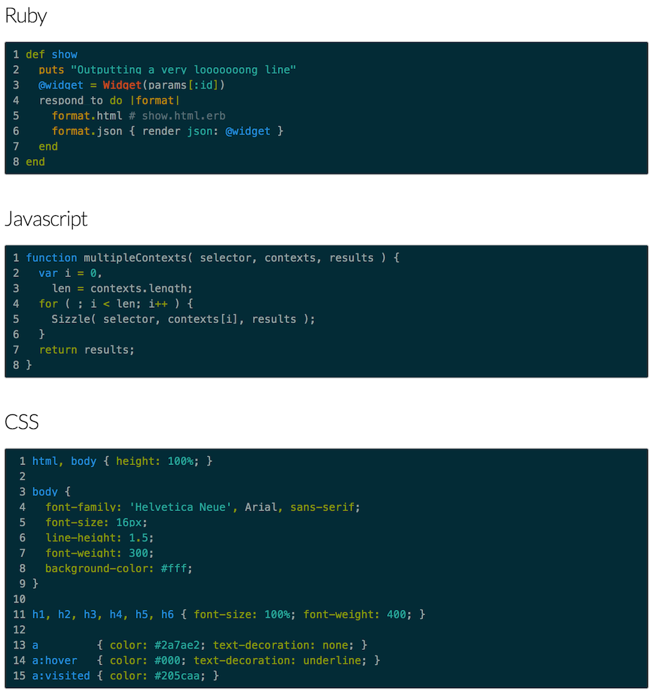

Pygments color themes
=====================

* [Monokai](#monokai)
* [Solarized Dark](#solarized-dark)
* [Tomorrow Light](#tomorrow-light)
* [Github Style](#github-style)

This is a collection of top pygments themes for syntax highlighting (github, monokai, solarized)

Comes as two versions:

- **Original (`theme`.css)**: For directly incorporating into any project that's using Pygments.

- **Jekyll Version (jekyll-`theme`.css)**: For use with [Jekyll](http://jekyllrb.com/), a blog-aware, static site generator in Ruby.

# Screenshots

###Monokai###

---
###Solarized Dark###

---
###Tomorrow Light###

---
###Github Style###

---
